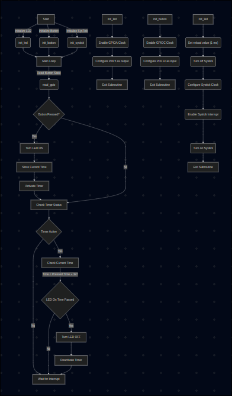

# STM32 Assembly Code Documentation

## Overview
This assembly code is designed for an **STM32 microcontroller**, configuring **GPIOA Pin 5 (LD2 LED) and GPIOC Pin 13 (Button)**. The LED is toggled **for 3 seconds** when the button is pressed, and the timing is managed using the **SysTick timer**.

## Features
✅ **GPIOA (PA5) Initialization** → Configures LD2 as an output.  
✅ **GPIOC (PC13) Initialization** → Configures the button as an input.  
✅ **SysTick Timer Setup** → Generates interrupts every millisecond.  
✅ **Button Handling (`read_gpio`)** → Detects button press events.  
✅ **LED Control in Main Loop** → Manages LED timing using `timer_ms`.

## Flowchart
The following diagram illustrates the flow of operations within the program:



---
## Memory Section
The memory section defines **global variables**:
- `timer_ms` → Keeps track of milliseconds.
- `button_press_time` → Stores the last button press timestamp.
- `led_timer_active` → Tracks whether LED is on.

```assembly
.section .bss
.global timer_ms
timer_ms: .word 0           @ Global millisecond timer
button_press_time: .word 0  @ Stores time when button was pressed
led_timer_active: .byte 0   @ Tracks whether LED timer is active
```
---
## Initialization functions

### LED setup
Configures **GPIOA PIN5** as ouput.
```assembly
init_led:
    movw r0, #:lower16:RCC_AHB2ENR
    movt r0, #:upper16:RCC_AHB2ENR
    ldr r1, [r0]
    orr r1, r1, #(1 << 0)   @ Enable GPIOA clock
    str r1, [r0]

    movw r0, #:lower16:GPIOA_MODER
    movt r0, #:upper16:GPIOA_MODER
    ldr r1, [r0]
    bic r1, r1, #(0b11 << (LD2_PIN * 2))  @ Clear PA5 bits
    orr r1, r1, #(0b01 << (LD2_PIN * 2))  @ Set PA5 as output
    str r1, [r0]
    bx lr
```

### Button setup
Configures **GPIOC PIN13** as an input.
```assembly
init_button:
    movw r0, #:lower16:RCC_AHB2ENR
    movt r0, #:upper16:RCC_AHB2ENR
    ldr r1, [r0]
    orr r1, r1, #(1 << 2)   @ Enable GPIOC clock
    str r1, [r0]

    movw r0, #:lower16:GPIOC_MODER
    movt r0, #:upper16:GPIOC_MODER
    ldr r1, [r0]
    bic r1, r1, #(0b11 << (BTN_PIN * 2))  @ Set PC13 as input
    str r1, [r0]
    bx lr
```

### SysTick Timer setup
Configures SysTick to **generate interrupts** every millisecond.
```assembly
init_systick:
    movw r0, #:lower16:STK_LOAD
    movt r0, #:upper16:STK_LOAD
    movw r1, #:lower16:HSI_FREC
    movt r1, #:upper16:HSI_FREC
    subs r1, r1, #1   @ SysTick reload value = HSI_FREQ - 1
    str r1, [r0]

    movw r0, #:lower16:STK_CTRL
    movt r0, #:upper16:STK_CTRL
    movs r1, #(1 << 0)|(1 << 1)|(1 << 2)  @ Enable counter, exception & clock
    str r1, [r0]
    bx lr
```
---
## Main program logic

### Button handling
Reads **GPIOC PIN13** state and returns **1** if pressed, **0** otherwise.
```assembly
read_gpio:
    movw r0, #:lower16:GPIOC_IDR
    movt r0, #:upper16:GPIOC_IDR
    ldr r1, [r0]
    tst r1, #(1 << BTN_PIN)  @ Check if button is pressed
    ite eq
    moveq r0, #1             @ Return 1 if pressed
    movne r0, #0             @ Return 0 if not pressed
    bx lr
```

### Main loop
```assembly
main:
    bl init_led
    bl init_button
    bl init_systick

    movw r4, #:lower16:timer_ms
    movt r4, #:upper16:timer_ms
    movw r5, #:lower16:button_press_time
    movt r5, #:upper16:button_press_time
    movw r6, #:lower16:led_timer_active
    movt r6, #:upper16:led_timer_active

loop:
    bl read_gpio
    cmp r0, #1
    bne check_timer  @ If button is not pressed, check timer

    @ Turn on LED and store button press time
    movw r0, #:lower16:GPIOA_ODR
    movt r0, #:upper16:GPIOA_ODR
    ldr r1, [r0]
    orr r1, r1, #(1 << LD2_PIN)
    str r1, [r0]

    ldr r2, [r4]
    str r2, [r5]  @ Store current time in button timestamp
    mov r1, #1
    strb r1, [r6]  @ Activate LED timer

check_timer:
    ldrb r1, [r6]
    cmp r1, #1
    bne wait_interrupt  @ Skip checking if LED timer is inactive

    @ Compare time since button press
    ldr r2, [r4]
    ldr r3, [r5]
    movw r7, #:lower16:LD2_TIME
    movt r7, #:upper16:LD2_TIME
    adds r3, r3, r7
    cmp r2, r3
    blt wait_interrupt  @ If time hasn't expired, wait for interrupt

    @ Turn off LED
    ldr r1, [r0]
    bic r1, r1, #(1 << LD2_PIN)
    str r1, [r0]

    mov r1, #0
    strb r1, [r6]  @ Deactivate LED timer

wait_interrupt:
    b loop
```

### SysTick Interrupt Handler
increments **timer_ms** every millisecond.
```assembly
```
---

## Final Summary
✅ Uses SysTick timer (timer_ms) for precise LED timing. ✅ Detects button press (read_gpio) and stores the timestamp. ✅ LED turns ON for 3 seconds when the button is pressed. ✅ Non-blocking timing using timer_ms for efficient execution.
