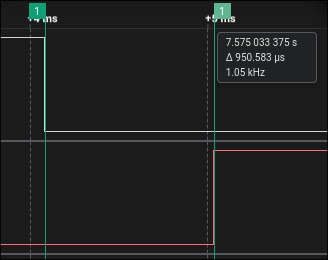

# **Informe: Laboratorio 1 - Periféricos Embebidos**
**Curso:** 4100901 - Estructuras Computacionales
**Autor:** Cristian Camilo Osorio Mesa
**Fecha:** 23 de junio de 2025

---

### **1. Resumen**

Este informe detalla los procedimientos y resultados del Laboratorio 1. El objetivo fue analizar y medir el comportamiento físico de periféricos clave en un microcontrolador STM32. Las mediciones se centraron en el tiempo de establecimiento de una señal de entrada, la latencia de respuesta a eventos externos y los tiempos de transmisión UART. A diferencia de los métodos de abstracción de alto nivel, la configuración de todos los periféricos se realizó **manualmente a nivel de registros**, lo que permitió un control directo sobre el hardware.

### **2. Objetivos**

#### **2.1. Objetivo General**
Comprender cómo funcionan físicamente los periféricos embebidos en un microcontrolador.

#### **2.2. Objetivos Específicos**
*   Medir el tiempo de establecimiento de la señal del botón azul de la Nucleo, considerando el efecto del filtro RC.
*   Medir el tiempo de procesamiento de un evento externo a diferentes frecuencias de reloj del sistema.
*   Medir el tiempo de bit y la duración total de transmisión de paquetes usando UART a distintas tasas de baudios.

### **3. Herramientas y Configuración**

*   **Hardware:**
    *   Placa STM32 NUCLEO-L476RG
    *   Analog Discovery 3 (usado como Osciloscopio y Analizador Lógico)
*   **Software:**
    *   **NVIM:** Editor de texto para el desarrollo del código.
    *   **PuTTY:** Terminal para verificar la recepción de datos UART.
    *   **Digilent Waveforms:** Software para controlar el Analog Discovery 3 y realizar las mediciones.
    *   **Saleae Logic 2:** Utilizado para las mediciones de tiempo de respuesta y análisis UART.
*   **Configuración del Microcontrolador:**
    La configuración de los periféricos (GPIO, EXTI, UART) se realizó **manualmente a nivel de registros**, sin utilizar STM32CubeMX. Esto incluyó la habilitación de los relojes de los periféricos, la configuración de los modos de los pines y el establecimiento de los parámetros de interrupciones y comunicación serie directamente en los registros correspondientes.

---

### **4. Procedimientos y Resultados**

#### **4.1. Medición 1: Tiempo de Establecimiento de Nivel Lógico**

**Procedimiento:**
Se analizó la señal del botón de usuario (PC13) utilizando la función de osciloscopio del Analog Discovery 3. Para aislar el efecto del filtro RC, se midió la señal en dos puntos:
1.  **Sin Filtro:** La señal se capturó directamente en el terminal del pulsador, antes del circuito RC de la placa.
2.  **Con Filtro:** La señal se midió en el pin del microcontrolador (PC13), después del filtro RC.

**Resultados:**
El filtro RC tuvo un impacto drástico en la eliminación del rebote (*bouncing*) y en el tiempo de estabilización de la señal.

| Configuración | Tiempo de Caída | Tiempo de Establecimiento | Observaciones |
| :--- | :---: | :---: | :--- |
| **Con Filtro RC** | 7.67 ns | **~270 ns** | La señal presenta oscilaciones menores y se estabiliza de forma muy rápida y limpia. |
| **Sin Filtro RC** | 7.74 ns | **~1.10 µs** | Se observa un rebote mecánico significativo, con múltiples oscilaciones de alta frecuencia antes de la estabilización. |

**Gráficas Obtenidas:**
*   **Señal Filtrada:** 
*   **Señal Sin Filtrar:** 

#### **4.2. Medición 2: Tiempo de Procesamiento de Evento Externo**

**Procedimiento:**
Se midió la latencia del sistema como el tiempo entre el flanco de bajada en PC13 (botón presionado) y el flanco de subida en PA5 (LED encendido). Se intentaron tres configuraciones de reloj, pero la configuración con PLL a 80 MHz no fue exitosa, probablemente por una configuración incorrecta de la latencia de la memoria FLASH o de los divisores de reloj.

**Resultados:**
El aumento de la frecuencia del reloj del sistema redujo drásticamente el tiempo de respuesta.

| Frecuencia de Reloj | Tiempo de Procesamiento Medido |
| :--- | :---: |
| **4 MHz (Default)** | **950.6 µs** |
| **16 MHz (HSI)** | **2.37 µs** |
| **80 MHz (PLL)** | *[Configuración fallida]* |

**Gráficas Obtenidas:**
*   **Respuesta a 4 MHz:** 
*   **Respuesta a 16 MHz (HSI):** 

#### **4.3. Medición 3: Tiempo de Bit y Transmisión de Paquete UART**

**Procedimiento:**
Se configuró manualmente el periférico USART2 para enviar el mensaje `"Hello word\r\n"` (13 caracteres). Con el analizador lógico, se midieron los tiempos de bit, byte (8 bits), paquete (frame de 10 bits) y la transmisión total. La transmisión a 921600 bps no funcionó correctamente.

**Cálculo Teórico del Tiempo de Transmisión:**
El tiempo total teórico se calcula como: `Número de Caracteres × Tiempo por Paquete`.
*   **Paquete UART:** 1 bit de inicio + 8 bits de datos + 1 bit de parada = 10 bits.
*   **Tiempo por Paquete (9600 bps):** 10 bits / 9600 bps = 1.042 ms.
*   **Tiempo Total Teórico (9600 bps):** 13 caracteres × 1.042 ms/char = **13.55 ms**.
*   **Tiempo por Paquete (115200 bps):** 10 bits / 115200 bps = 86.8 µs.
*   **Tiempo Total Teórico (115200 bps):** 13 caracteres × 86.8 µs/char = **1.128 ms**.

**Resultados Medidos:**

| Tasa de Baudios | Tiempo de Bit | Tiempo de Paquete (10 bits) | Tiempo Total Medido | Tiempo Total Teórico |
| :--- | :---: | :---: | :---: | :---: |
| **9600 bps** | 103.33 µs | 1.03 ms | **13.39 ms** | 13.55 ms |
| **115200 bps** | 8.46 µs | 85.5 µs | **1.09 ms** | 1.128 ms |
| **921600 bps** | *[Fallo]* | *[Fallo]* | *[Fallo]* | *[Fallo]* |

**Gráficas Obtenidas:**

*   **Mediciones a 9600 bps:**
    *   **Duración de Bit:** 
    *   **Duración de Paquete:** 
    *   **Mensaje Completo:** 
    *   **Tabla de Caracteres:** 

*   **Mediciones a 115200 bps:**
    *   **Duración de Bit:** 
    *   **Duración de Paquete:** 
    *   **Mensaje Completo:** 
    *   **Tabla de Caracteres:** 

---

### **5. Análisis y Conclusiones**

1.  **Efecto del Filtro RC en Entradas Digitales:** Los resultados demuestran la importancia de un filtro de hardware. La señal sin filtrar mostró un tiempo de establecimiento de **1.10 µs** debido al rebote, lo que podría causar lecturas múltiples. En contraste, el filtro RC redujo este tiempo a solo **270 ns**, proporcionando una señal limpia y confirmando que es esencial para la fiabilidad de las entradas mecánicas.

2.  **Relación entre Frecuencia de Reloj y Latencia:** Los datos de la segunda medición son concluyentes. Al aumentar la frecuencia del sistema de **4 MHz a 16 MHz (HSI)**, el tiempo de respuesta a la interrupción se redujo drásticamente, pasando de **950.6 µs a 2.37 µs**. Esto demuestra la relación directa entre velocidad de reloj y capacidad de respuesta. El fallo en la configuración de 80 MHz resalta la complejidad de la configuración manual a nivel de registros, donde es crucial ajustar parámetros dependientes como la latencia de la FLASH para garantizar la estabilidad a altas frecuencias.

3.  **Precisión de la Comunicación UART:** Las mediciones de UART fueron altamente consistentes y se alinearon estrechamente con la teoría. A **9600 bps**, el tiempo de transmisión medido (**13.39 ms**) fue muy cercano al teórico (**13.55 ms**). De igual manera, a **115200 bps**, el tiempo medido (**1.09 ms**) coincidió casi perfectamente con el teórico (**1.128 ms**). Estas pequeñas diferencias son despreciables y validan tanto la precisión del reloj del microcontrolador como el funcionamiento correcto del periférico UART. La falla a 921600 bps, similar al problema con el PLL, sugiere que las altas velocidades de comunicación requieren una configuración de reloj del sistema aún más precisa o pueden exceder las capacidades del oscilador interno (HSI) usado como fuente de reloj para el periférico.
