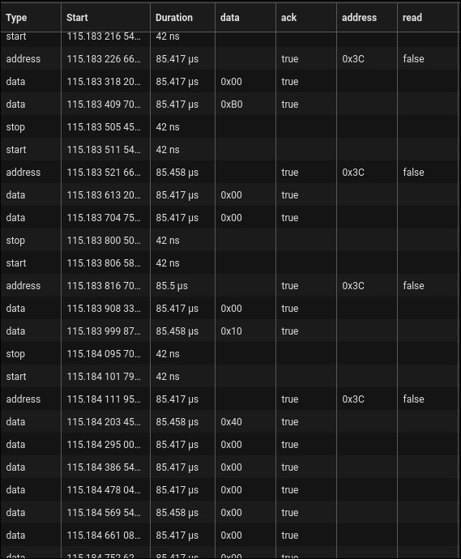
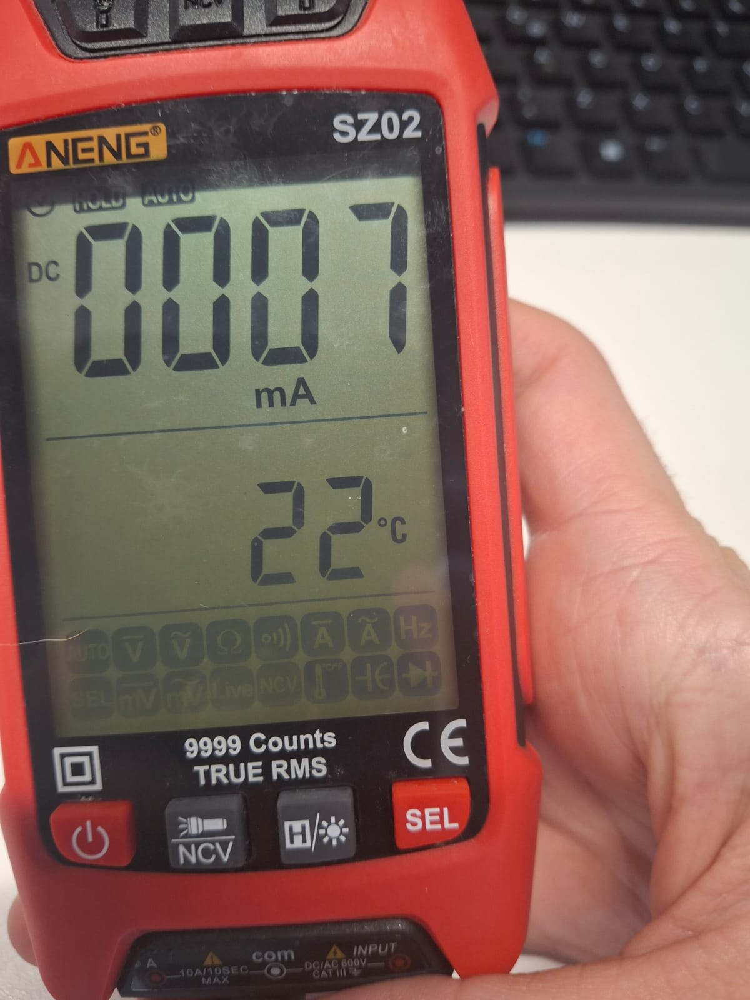

# **Informe: Laboratorio 2 - Medición y Optimización de Drivers Embebidos**
**Curso:** 4100901 - Estructuras Computacionales
**Autores:**
*   Cristian Camilo Osorio Mesa
*   Santiago Bustamante Montoya

**Fecha:** 24 de Julio de 2025

---

### **1. Introducción**

En este laboratorio se aplicaron conceptos prácticos de medición y optimización de drivers en un sistema embebido basado en el microcontrolador STM32L476RG. El objetivo fue cuantificar el rendimiento de nuestro código base ("Room Control Final 2025_1") y explorar técnicas para mejorar su eficiencia en tiempo de ejecución y consumo de energía. Para ello, se utilizaron herramientas como un analizador lógico para mediciones temporales precisas, un script de Python para la evaluación de latencia de comunicación y un multímetro para analizar el consumo de corriente en diferentes modos de operación del microcontrolador.

### **2. Objetivos**

#### **2.1. Objetivo General**
*   Entender cómo funcionan, se miden y se optimizan los drivers embebidos en un microcontrolador.

#### **2.2. Objetivos Específicos**
*   Medir el tiempo de transmisión de datos a través de un periférico I2C.
*   Analizar cómo los diferentes niveles de optimización del compilador afectan el tiempo de respuesta a eventos.
*   Comparar la latencia de comunicación entre USB y WiFi.
*   Medir y comparar el consumo de corriente del microcontrolador en diferentes modos de operación.

### **3. Herramientas y Configuración**

*   **Hardware:**
    *   Placa NUCLEO-L476RG
    *   Display OLED SSD1306 (conectado a I2C1: PB8-SCL, PB9-SDA)
    *   Teclado matricial 4x4
    *   Módulo ESP01
    *   Analizador Lógico
    *   Multímetro
*   **Software:**
    *   Proyecto base "Room Control Final 2025_1"
    *   Python 3.x (`pyserial`, `socket`)
    *   Software de análisis lógico (Saleae Logic 2)

---

### **4. Procedimientos y Resultados**

A continuación, se detallan los procedimientos y resultados obtenidos para cada una de las tres partes del laboratorio.

#### **4.1. Parte 1: Medición de Tiempo de Transmisión I2C**

**Procedimiento:**
Se utilizó el proyecto base para actualizar un display OLED SSD1306. Se conectaron dos canales del analizador lógico a las líneas I2C1 (PB8-SCL, PB9-SDA). Se configuró el software del analizador para decodificar el protocolo I2C y se capturó una transmisión completa, correspondiente a la actualización de un *frame* en la pantalla.

**Resultados:**
El tiempo total para transmitir un *frame* completo fue de **102.451 ms**. Analizando en detalle, se observaron los siguientes tiempos característicos:
*   **Duración de bits de Start/Stop:** 42 ns.
*   **Duración de transmisión de paquete (Dirección o Dato):** ~85 µs.

**Gráficas Obtenidas:**

*Captura de la transmisión completa del frame:*

*Detalle de la transmisión de un paquete individual:*

*Verificación de la correcta alineación entre SCL y SDA:*

#### **4.2. Parte 2: Medición de Latencia y Optimización del Compilador**

**Procedimiento:**
Se utilizó el script `timing_comparison.py` para medir los tiempos de llegada de paquetes enviados simultáneamente a través del puerto serie del ST-Link (USB) y de un módulo ESP01 (WiFi). El análisis se centró en la **diferencia de latencia** entre la llegada del primer y el segundo paquete. Para cada uno de los cuatro niveles de optimización del compilador (`-O0`, `-Og`, `-O3`, `-Os`), se realizaron **tres mediciones** para observar la consistencia y calcular un promedio.

**Resultados:**
Los datos recopilados muestran la diferencia absoluta en los tiempos de llegada entre los dos protocolos. Se observó que ningún protocolo fue consistentemente más rápido.

**Tabla de Resultados: Diferencia de Latencia (WiFi vs. USB)**
| Nivel de Optimización | Diferencia Promedio (ms) | Desviación Estándar (ms) | Min (ms) | Max (ms) | Observaciones |
| :--- | :--- | :--- | :--- | :--- | :--- |
| **-O0** (Sin optimización) | 0.924 | 0.152 | 0.750 | 1.014 | Mayor variabilidad en los resultados. |
| **-Og** (Debug optimizado) | 0.948 | 0.020 | 0.925 | 0.962 | Tiempos mucho más consistentes. |
| **-O3** (Máxima velocidad) | 0.964 | 0.014 | 0.952 | 0.978 | La latencia es muy estable y predecible. |
| **-Os** (Tamaño optimizado) | 0.947 | 0.009 | 0.938 | 0.956 | Rendimiento similar a -Og, muy estable. |

#### **4.3. Parte 3: Medición de Consumo de Corriente**

**Procedimiento:**
Se conectó un multímetro en modo amperímetro en serie con la línea de alimentación de 3.3V de la placa. Se midió el consumo en dos escenarios:
1.  **Modo RUN:** Con el microcontrolador ejecutando el bucle principal a 80 MHz.
2.  **Modo SLEEP:** Con el microcontrolador en modo de bajo consumo (`WFI`), esperando una interrupción externa.

**Resultados:**
Se observó una diferencia significativa en el consumo de energía entre los dos modos de operación.

| Modo de Operación | Descripción | Consumo de Corriente Medido |
| :--- | :--- | :--- |
| **Run Mode** | CPU activa a 80 MHz, periféricos encendidos. | **~18 mA** |
| **Sleep Mode** | CPU detenida, esperando interrupción externa. | **7 mA - 11 mA** |

**Gráficas Obtenidas:**

*Consumo estable en Modo RUN:*

*Picos de consumo máximo y mínimo en Modo SLEEP (probablemente durante breves despertares o actividad de periféricos):*

---

### **5. Análisis y Conclusiones**

*   **Rendimiento I2C:** La transmisión de un frame completo toma **102.45 ms**, lo que equivale a una tasa de refresco aproximada de 9.76 Hz. Para una interfaz de usuario que no requiere animaciones fluidas, este rendimiento es aceptable. Sin embargo, para aplicaciones gráficas más intensivas, se podría explorar el uso de un bus más rápido como SPI o la optimización del driver I2C.

*   **Latencia y Optimización:** Los resultados demuestran que, si bien la diferencia de latencia entre USB y WiFi se mantiene alrededor de 1 ms, el **nivel de optimización del compilador tiene un impacto drástico en la consistencia del sistema**. Con `-O0`, la alta variabilidad (desviación estándar de 0.152 ms) indica un comportamiento menos determinista. En contraste, los niveles `-Og`, `-O3` y `-Os` ofrecen una latencia muy estable. Esto es crucial en sistemas embebidos. La inconsistencia sobre qué protocolo llega primero sugiere que las mayores fuentes de latencia no están en el procesamiento del MCU, sino en factores externos como el stack de red WiFi y el scheduling del sistema operativo del PC.

*   **Consumo de Energía:** El paso del Modo RUN al Modo SLEEP produjo una reducción de consumo muy significativa. El consumo se redujo desde un valor estable de **18 mA** a un mínimo de **7 mA**, lo que representa una **disminución de más del 60%**. Este ahorro se logra simplemente deteniendo el núcleo de la CPU con una instrucción (`WFI`). El consumo en modo sleep no baja al rango de microamperios porque se utilizó un modo de sueño ligero, donde los periféricos y sus relojes permanecen activos. Para un ahorro aún mayor, sería necesario utilizar modos de sueño profundo (como STOP2 o STANDBY) que apagan más dominios de la placa. No obstante, esta medición demuestra el impacto masivo que una simple optimización de software puede tener en la eficiencia energética, un factor crítico para cualquier dispositivo alimentado por batería.
